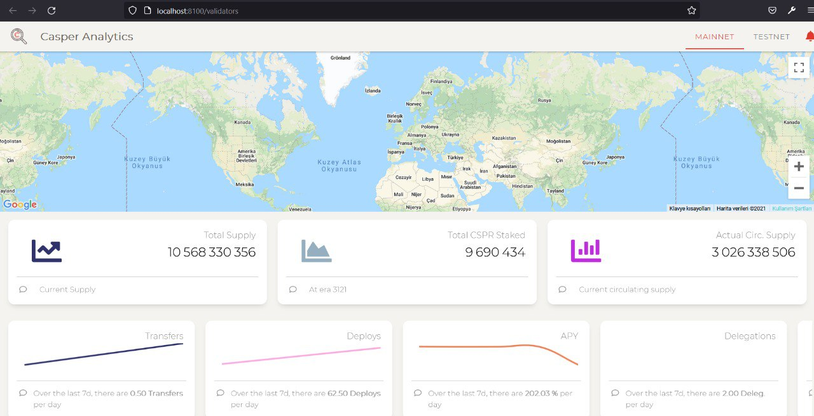
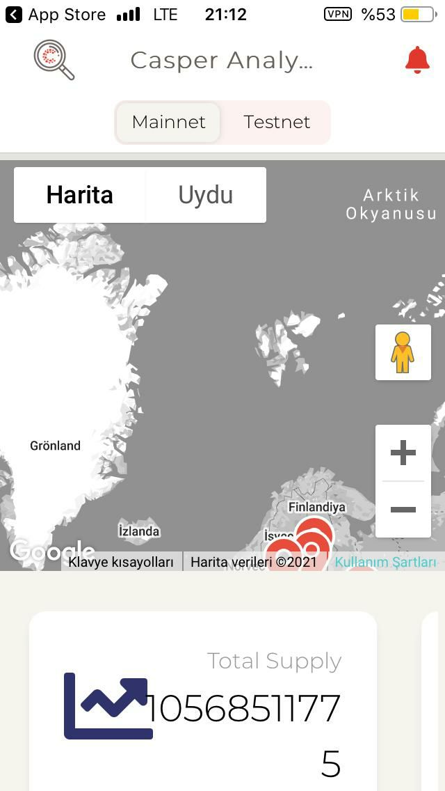
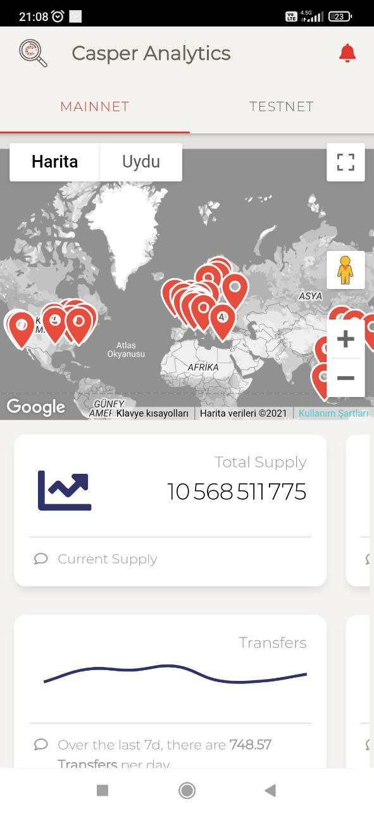
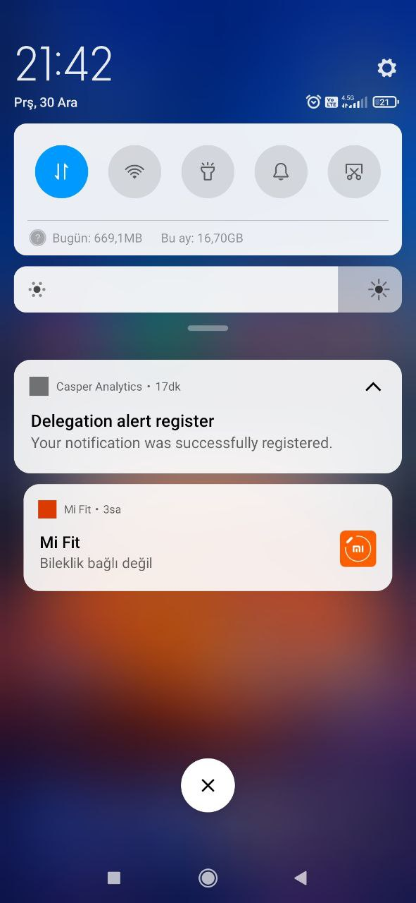

Grant Proposal | [32 - 219-1-5 - Casper Analytics - iOS/Android/Web](https://crdao.ossa.dev/Job-Detail/32)
------------ | -------------
Milestone | 1
Milestone Title | Webapplication and API
OP | tmesser
Reviewer | Ebubekir Yardımcı

# Milestone Details

## Details & Acceptance Criteria

**Details of what will be delivered in milestone:**

- Installation of Casper Analytics web and api project with Readme file.
- Control of web pages.
- Control of mobile application.
- Project's casper signer connection control.

**Acceptance criteria:**

- Link to the repository of the API 
- Link to the repository of the Webapp 
- Webpp published on a specific website (the name of the website have to be defined) with pages
- App available on the PlayStore
- App available on the AppStore
- Create an alert via your smartphone or via a compatible browser.
- Make a delegation using the casper signer

**Additional notes regarding submission from OP:**


## Milestone Submission

The following milestone assets/artifacts were submitted for review:

Repository | Revision Reviewed
------------ | -------------
https://github.com/caspercommunityio/casper-analytics-api | 3377681
https://github.com/caspercommunityio/casper-analytics-app | 08fa0a6

# Install & Usage Testing Procedure and Findings



Reviewer was able to build and run the project by using the instructions given on the README of the project, after needed parameters entering to the .env file as per the instructions for the api project.
```
Laravel development server started: http://127.0.0.1:8000
[Thu Dec 30 20:17:33 2021] PHP 7.4.27 Development Server (http://127.0.0.1:8000) started
```

Reviewer got the following error when following the instructions in the readme file,but was able to run the project when reviewer changed the 'es2018' package to 'es2020' in the lib variable in the 'tsconfig.json' file for the webapp project.  

```
ng] 70 unchanged chunks
[ng] Build at: 2021-12-30T17:13:23.002Z - Hash: 83a329b9e80215f07ed8 - Time: 1191ms
[ng] Error: node_modules/buffer/index.d.ts:23:38 - error TS2583: Cannot find name 'BigInt'. Do you need to change your target library? Try changing the lib compiler option to 'es2020' or later.   
[ng] 23     readBigUInt64LE(offset: number): BigInt;
[ng]                                         ~~~~~~
[ng] Error: node_modules/buffer/index.d.ts:24:38 - error TS2583: Cannot find name 'BigInt'. Do you need to change your target library? Try changing the lib compiler option to 'es2020' or later.   
[ng] 24     readBigUInt64BE(offset: number): BigInt;
[ng]                                         ~~~~~~
[ng] Error: node_modules/buffer/index.d.ts:30:37 - error TS2583: Cannot find name 'BigInt'. Do you need to change your target library? Try changing the lib compiler option to 'es2020' or later.   
[ng] 30     readBigInt64LE(offset: number): BigInt;
[ng]                                        ~~~~~~
[ng] Error: node_modules/buffer/index.d.ts:31:37 - error TS2583: Cannot find name 'BigInt'. Do you need to change your target library? Try changing the lib compiler option to 'es2020' or later.   
[ng] 31     readBigInt64BE(offset: number): BigInt;
[ng]                                        ~~~~~~
[ng] Error: node_modules/buffer/index.d.ts:45:54 - error TS2583: Cannot find name 'BigInt'. Do you need to change your target library? Try changing the lib compiler option to 'es2020' or later.   
[ng] 45     writeBigUInt64LE(value: number, offset: number): BigInt;
[ng]                                                         ~~~~~~
[ng] Error: node_modules/buffer/index.d.ts:46:54 - error TS2583: Cannot find name 'BigInt'. Do you need to change your target library? Try changing the lib compiler option to 'es2020' or later.   
[ng] 46     writeBigUInt64BE(value: number, offset: number): BigInt;
[ng]                                                         ~~~~~~
[ng] Error: node_modules/buffer/index.d.ts:52:53 - error TS2583: Cannot find name 'BigInt'. Do you need to change your target library? Try changing the lib compiler option to 'es2020' or later.   
[ng] 52     writeBigInt64LE(value: number, offset: number): BigInt;
[ng]                                                        ~~~~~~
[ng] Error: node_modules/buffer/index.d.ts:53:53 - error TS2583: Cannot find name 'BigInt'. Do you need to change your target library? Try changing the lib compiler option to 'es2020' or later.   
[ng] 53     writeBigInt64BE(value: number, offset: number): BigInt;
```
Change in tsconfig.json file :

```
//"lib": ["es2018", "dom"],
"lib": ["es2020", "dom"],
```

After the change :

```
[ng] ✔ Browser application bundle generation complete.
[ng] 70 unchanged chunks
[ng] Build at: 2021-12-30T17:27:51.614Z - Hash: 5f27c798b72c0eea15be - Time: 1370ms
[ng] √ Compiled successfully.
```

Pages on the website are working properly :


Mobile application working properly : 




Mobile application working properly : 


![img.png](assets/notifications.jpg

## Overall Impression of usage testing

Reviewer was able to build and run the project by following the provided instructions, and test the functionality and usage on the already deployed instance. The documentation also provides sufficient installation/execution instructions for different scenarios. Reviewer observed that the project functionality meets/exceeds acceptance criteria and operates without error generally. It was seen that the production deployment didn't have a proper SSL configuration; however this does not cause a failure as it is a deployment-specific issue which can be fixed without changing the source code.


Requirement | Finding
------------ | -------------
Project builds without errors | FAIL
Documentation provides sufficient installation/execution instructions | PASS
Project functionality meets/exceeds acceptance criteria and operates without error | PASS

# Unit / Automated Testing

After installing the requirements and adding the necessary configuration settings by following the given instructions on the project's README, the reviewer was able to run the tests under the `RFPPortal_Tests` directory. All positive, negative, and additional path tests were observed to run successfully.

```bash
cd RFPPortal_Tests
dotnet test --filter DisplayName~Authorization_Tests
```


```bash
dotnet test --filter DisplayName~BidController_Tests
```


```bash
dotnet test --filter DisplayName~RfpController_Tests
```


Requirement | Finding
------------ | -------------
Unit Tests - At least one positive path test | PASS
Unit Tests - At least one negative path test | PASS
Unit Tests - Additional path tests | PASS

# Documentation

### Code Documentation

Reviewer observed that all critical functions of the project had low-level code documentation which could be used for automated documentation generation. Reviewer praises the OP for the intensive code-level documentation.

Requirement | Finding
------------ | -------------
Code Documented | PASS

### Project Documentation

Reviewer observed that the project's README had detailed general and usage documentation, exceeding the requirements.

Requirement | Finding
------------ | -------------
Usage Documented | PASS

## Overall Conclusion on Documentation

Reviewer concludes that the project has extensive overall documentation, at both the high and the low level.

# Open Source Practices

## Licenses

The Project is released under the MIT License

Requirement | Finding
------------ | -------------
OSI-approved open source software license | PASS

## Contribution Policies

Pull requests and Issues are enabled. However, the project does not contain a CONTRIBUTING policy. It is highly suggested that the OP should add a proper contribution policy to provide guidelines for the potential contributors as it is crucial for the sustainability of an open-source project. However, this is not a reason to fail the whole submission, in the reviewer's opinion.

Requirement | Finding
------------ | -------------
OSS contribution best practices | FAIL

# Coding Standards

## General Observations

Code is generally well-structured and readable. The project as committed to GitHub and both the unit tests and the manual tests pass.

# Final Conclusion

The project provides the functionality described in the grant application and milestone acceptance criteria. It also meets or exceeds the standards required by the DEVxDAO. However, it is highly suggested to add a CONTRIBUTING policy to the project. Thus, in the reviewer's opinion, this submission should pass with notes.

# Recommendation

Recommendation | PASS (Improvements Suggested)
------------ | -------------

